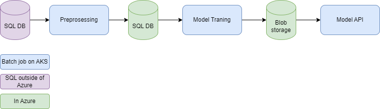
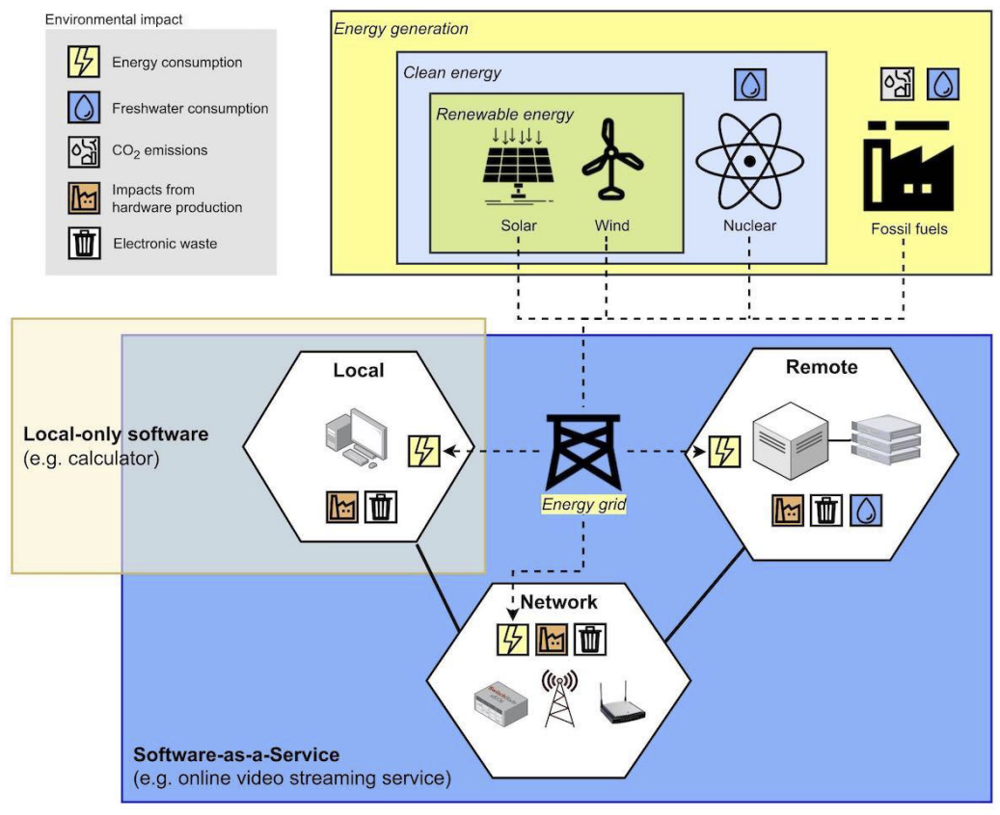
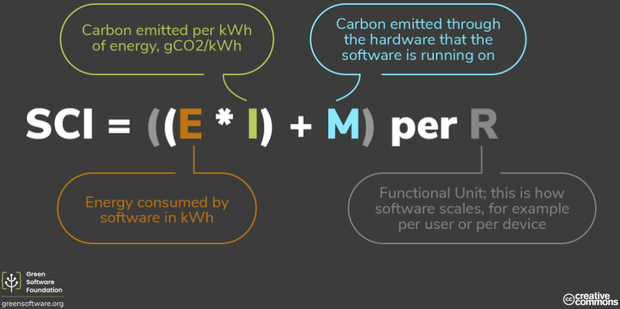

# cs-e4660 Course repo

## Dir Structure 

- `/study-logs` Study logs written over the course of the course

## Project: Green e2e ML (working title)

### Background

- At work we have an ML pipeline, which currently has no proper orchestration & no workflow engine used
- The pipeline is quite simple, however, there are more similar simple pipelines coming in the future
- Engineering challenge: how to support and maintain ML pipelines on existing (shared) infra with quite small DevOps team

#### Existing pipeline

- Financial management SaaS product
- Invoice field predictions (VAT %, amount, receiver, etc...) using Randomforest classifier
- Similar pipelines expected in the future to help predict finacial management & accounting related
- ML pipelines run on a (shared) Kubernetes cluster (AKS)

### Task 1: Create proper ochrestration and e2e workflow using workflow engine

- Compare Apache airflow, Kubeflow and Argo Workflows, see which one is best suited for this system
- Create mock pipeline (can't use real data or real ML solution) which closely simulates the real system
  - containerized jobs on kubernetes for preprosessing, training and model api
  - mock dbs (whatever easiest, maybe also on kubernetes)
- Create orchestration and e2e pipeline with selected technology
- See how the pipeline solution supports and enables R3E + Monitoring, Observability & Experimenting
  - what restrictions come from existing ML pipeline, what restrictions (potentially) come from workflow pipeline solution being implemented
  - what areas of R3E + Monitoring, Observability & Experimenting can't be solved by orchestration & workflow engine (just figure out, supporting these out of scope)

### Task 2: How to make the e2e pipeline green

- What is green?
- Lowest possible CO2 emissions, lowest waste, lowest resource consumption
- What is in our control?
- Second motivation: green == cheap (largely)

*Green in software engineering: tools, methods and practices for reducing the
environmental impacts of software use – a literature review (Mehtälä 2023)*

#### 1. Batch job scheduling

"Carbon aware software". Run batch jobs when *Carbon intensity(\*)* is low. APIs exist (https://github.com/Green-Software-Foundation/carbon-aware-sdk) to check grid status. -> Run batch jobs when carbon intensity is at it's lowest. 

*(\*)Carbon intensity: How much electricity in the electric grid comes from fossil fuels. The ratio between different sources of electricity in the electric grid changes based on eg. wind & time of day/time of week.*

#### 2. Model traning frequency

Currently model traning is run nightly. How often is actually required? How to predict when (lower bound) to run the training with out losing accuracy. 

#### 3. Track SCI metric of whole pipeline & parts

*Green software foundation*

- See which parts of the pipeline contribute most to co2 emissions
- See trends over time, sudden increases etc.
- SCI: https://learn.greensoftware.foundation/measurement/#the-sci-equation

#### 4. (Other methods to be discovered)

### Open questions:

1. Where to run, is local kube cluster enough, can school provide cloud cluster?