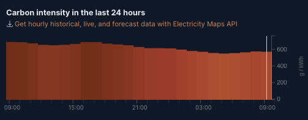
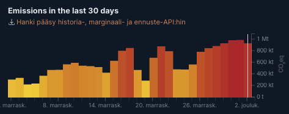
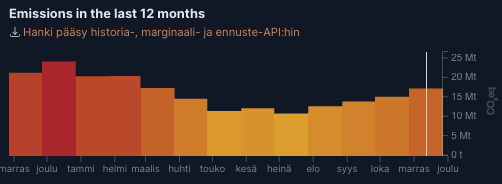
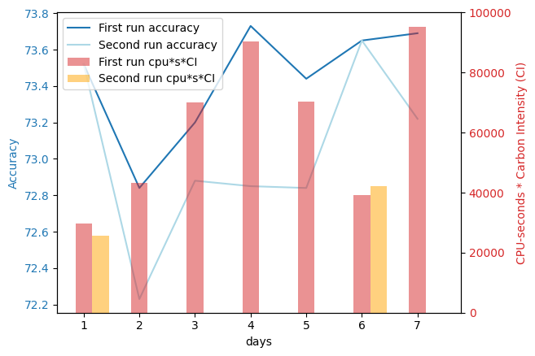

# cs-e4660 Course repo

## Dir Structure

Most of the project and course tasks are contained in folders, which contain their own documentation:

- `./data` The dataset used in the project
- `./data-fetch` Project mock data fetcher
- `./database` Config for database used in project
- `./metrics` Configuration of metrics collection and monitoring for project
- `./model-api` Project model api serving predictions
- `./model-training` Project model training
- `./pipeline` Argo workflows and pipelines config for project
- `./preprocessing` Project mock preprocessing
- `./project-plan` The initial project plan
- `./scheduler` Project scheduler
- `./study-logs` Study logs written during the course
- `./testing` Testing of project things, eg. feature selection from dataset.

## Project: Green e2e ML
Seen initial project plan in [project-plan](./project-plan/) folder

### Background

- At work we have an ML pipeline, which currently has no proper orchestration & no workflow engine used
- The pipeline is quite simple, however, there are more similar simple pipelines coming in the future
- Engineering challenge: how to support and maintain ML pipelines on existing (shared) infra with quite small DevOps team

#### Existing pipeline

- Financial management SaaS product
- Invoice field predictions (VAT %, amount, receiver, etc...) using Randomforest classifier
- Similar pipelines expected in the future to help predict financial management & accounting related
- ML pipelines run on a (shared) Kubernetes cluster (AKS)


#### ESG

- Environmental, Social and Governance
- The company is taking steps towards ESG
- What can be done to be more environmental?


### Challenges to be solved

This project attempts to solve two main challenges:

1. Best solution for DevOps engineers to create and maintain ML pipelines on a shared (Azure) Kubernetes cluster
2. How to make the pipelines green (and by proxy cheap and efficient)


### Challenge 1 Solution: Proper orchestration and e2e workflow using workflow engine

#### Pipeline Orchestration tools Comparison

Here is a comparisons table based on the different requirements of the system described above.

|                                                | Argo Workflows | Kubeflow | Apache airflow |
|------------------------------------------------|----------------|----------|----------------|
| Kubernetes support                             |       yes      |     yes  | technically yes, could not get working |
| CasC                                           |       yaml (kubernetes)         |    pipeline sdk (python)/proprietary dsl      |      python sdk (not tested)          |
| Learning curve for DevOps <br> (personal estimate) |    medium(*)   |    high(**)      |       n/a     |
| Scheduling                                      |        yes     |          |                |
| Event triggering                               |        yes     |          |                |
| Logging                                        |      Kubernetes logs (native kubernetes jobs)       |          |                |
| Alerting                                       |      integrations to slack and Opsgenie          |          |                |
| Good UI (usable by ML engineers)               |                |          |                |


(*) kubernetes like yaml syntax to configure workflows 

(**) Uses argo workflow under the hood, but configured in python. This might be the best solution for ML engineers, but since in this case the pipeline needs to be maintained by DevOps engineers it's not ideal,


#### Mock pipeline parts

Based on the comparison Argo Workflows as chosen as the pipeline orchestration tool / workflow engine. This means the different pipeline steps are containerized, more info on these in their own folders (in order):

- `./data-fetch` Project mock data fetcher
- `./preprocessing` Project mock preprocessing
- `./model-training` Project model training
- `./model-api` Project model api serving predictions

The initial pipeline solution was to use kubernetes (batch) Jobs. These configurations can still be seen in the folders above, but aren't utilized in the final solution.

#### Argo workflows and the pipeline

The Argo workflow configuration and pipeline configurations are in the `./pipeline` folder.

#### Discussion on the pipeline solution

The functionality of the pipeline is documented in `./pipeline/argo.md`


### Challenge 2 Solution: Making the pipeline green

#### Pipeline scheduling

##### Carbon intensity of german electric grid  


\
Source: https://app.electricitymaps.com/zone/DE


We can see a clear year-over-year trend in the carbon intensity (summers have lower carbon intensity). However, day-to-day and hourly carbon intensity does not have clear trends. This makes determining when to run beforehand difficult.

Scheduling can help make the pipeline green in two ways:
- scheduling frequency
  - the real pipeline is currently run nightly, but by assessing model performance on incoming training data (or potentially by getting feedback on predictions) we can make determinations on when to re-train the model(s)
- scheduling timing
  - the *carbon intensity* of the electric grid changes based on certain factors (see [Planning document](./project-plan/plan.md) for more details)
  - the mock pipeline is run in a local kubernetes cluster, but we pretend it's running in a specific Azure datacenter (west europe) and use APIs to see when the datacenter has low carbon intensity

This table shows the plan to combine both scheduling factors into one solution:

| Accuracy of model on new training data | Action  |
|----------------------------------------|---------|
| Small decrease compared to initial training accuracy (to be quantified) | Retrain model once carbon intensity drops below set threshold |
| Big decrease ...                                                       | Retrain model immediately |


For this, a scheduler was developed (in `./scheduler` folder). The scheduler is configured to run periodically (using an Argo CronWorkflow see `./pipeline/scheduler-cron.yaml`), and it checks the conditions defined above, and triggers re-training of the model and re-deployment of model-api.

#### Metrics collection

The initial plan was to use Scaphandre (https://hubblo-org.github.io/scaphandre-documentation/index.html) to get energy consumption metrics from the pipeline. However, I had to switch from my old pc to a mac mid project, and Scaphandre did not support the M1 mac. For this reason an ordinary Prometheus stack was deployed and used for metrics collection. The implementation is described deeper in `./metrics`. 


### Demo:

```bash 
#Commands for the demo
argo submit full-pipeline.yaml -p n_rows="100000"
argo submit data-fetch-pipeline.yaml -p n_rows="50000" -p start_row="100000"
<trigger scheduler from ui>
argo cron create scheduler-cron.yaml
<trigger scheduler from ui>

kubectl get pod -o jsonpath='{.metadata.uid}'

curl -X POST -H "Content-Type: application/json" \
-d '{"row": [ 2, 5, 11, 10, 4 ]}' \
http://localhost:30004/predict
```


### Experimental results using the scheduler

To test the scheduler, we need to define a scenario and compare the pipeline when using the scheduler vs without it. For this we first need to explain how this testbed setup imitates the real setup:

#### Emulating the real environment (story)
##### Real:
- The real environment runs on an AKS cluster in the west europe datacenter. 
- The aks cluster has an autoscaling nodepool. 
- This means that the cluster is able to scale based on resources usage. 
- Full e2e pipeline runs once a week.
##### Emulation:
- The testbed is a local aks cluster on my machine. 
- we pretend it's a scalable custer running in west europe (Germany). 
- Data ingestion triggered manually.
- pipeline triggered manually or through scheduler

#### Test scenario

We also need to define a scenario:
- Let's say we have a company that has 100k invoices (rows of data). 
- They get/create 20k new invoices per week.
- Let's compare using the scheduler vs using the naive approach training once a week.
- Let's set the carbon intensity threshold for the scheduler at 400 (gCO2/kWh)
- Let's collect both model accuracy, and `container_cpu_usage_seconds_total` of model-training from prometheus. (We are unable to collect metrics from scheduler, because it terminates too quickly) 
- The model training does some fake computation (matrix multiplication on radom inputs tied to training data size) so it lasts long enough for metrics to appear. (my new computer is much faster than my old one, so this was implemented as a last resort hack)
- Lets run this experiment for 7 "weeks"

To get realistic carbon intensity data, I've collected the average per day carbon intensity of the German electric grid from https://app.electricitymaps.com/zone/DE for the period 14.11-20.11.2023.
here's the data: `[282, 445, 552, 615, 404, 224, 448]`. These are gCO2/kWh.

We've emulated the scenario with the following commands:
```
argo submit full-pipeline.yaml -p n_rows="100000" -p fake_computation="true"
0.7352
105.7
argo submit full-pipeline.yaml -p n_rows="20000" -p start_row="100000" -p fake_computation="true"
0.7284
97.4
argo submit full-pipeline.yaml -p n_rows="20000" -p start_row="120000" -p fake_computation="true"
0.7320
126.8
argo submit full-pipeline.yaml -p n_rows="20000" -p start_row="140000" -p fake_computation="true"
0.7373
146.9
argo submit full-pipeline.yaml -p n_rows="20000" -p start_row="160000" -p fake_computation="true"
0.7344
174.2
argo submit full-pipeline.yaml -p n_rows="20000" -p start_row="180000" -p fake_computation="true"
0.7365
175.0
argo submit full-pipeline.yaml -p n_rows="20000" -p start_row="200000" -p fake_computation="true"
0.7369
212.8

argo submit full-pipeline.yaml -p n_rows="100000" -p fake_computation="true"
<trigger scheduler from ui>
0.7352
91.3
argo submit data-fetch-pipeline.yaml -p n_rows="20000" -p start_row="100000"
<trigger scheduler from ui>
0.7223
0
argo submit data-fetch-pipeline.yaml -p n_rows="20000" -p start_row="120000"
<trigger scheduler from ui>
0.7288
0
argo submit data-fetch-pipeline.yaml -p n_rows="20000" -p start_row="140000"
<trigger scheduler from ui>
0.7285
0
argo submit data-fetch-pipeline.yaml -p n_rows="20000" -p start_row="160000"
<trigger scheduler from ui>
0.7284
0
argo submit data-fetch-pipeline.yaml -p n_rows="20000" -p start_row="180000"
<trigger scheduler from ui>
0.7365
188.1
argo submit data-fetch-pipeline.yaml -p n_rows="20000" -p start_row="200000"
<trigger scheduler from ui>
0.7322
0
```

#### Results

The results were plotted using `./metrics/metrics.ipynb`



We can see that the accuracy lower for the second scenario, since the model is re-trained only once. The difference in accuracy is less than a percentage. The CPU-seconds*CI is much lower for the second run, because the model is re-trained only once on a day when there is low carbon intensity.

To calculate the difference in carbon usage we'll to define kWh/cpu*s as x. Then we can calculate the how much more the first methods uses carbon (%-wise) than the second: (sum(1st_cpu\*s\*CI\*x)-sum(2nd_cpu\*s\*CI\*x))/(sum(2nd_cpu\*s\*CI\*x)). (done in `./metrics/metrics.ipynb`)

**We get a result of 545% more carbon used by the first run than the second.**


### Shortcomings and improvement ideas

- The dataset is fake, to get accurate results we need to run the experiment with real data (and the real model implementation)
- Metrics are limited on the local cluster, especially on M1 Mac
- Tests on larger datasets require a 'real' cluster. A real cluster is also required for more reliable results. 
- The fake computation makes the results possibly unrealistic
- The experimentation does not consider carbon usage of the scheduler, because it was too quick to run, and metrics weren't available. 
- The scheduling of data import & preprocessing is not considered. This could be improved by triggering fetch & preprocessed only when there is a certain amount of new data available. This can be assessed based on model performance on average given a certain amount of new data.
- The ElectricityMaps api has a paid subscription including endpoints for CI future estimation. This could be taken into account in the scheduler. Further, the scheduler could use a webhook style approach instead of the scheduler approach. 
- Think about where to deploy the pipeline. See https://app.electricitymaps.com/ for carbon intensity comparisons between different countries.
- Argo workflow metrics can be integrated into prometheus https://argoproj.github.io/argo-workflows/metrics/
- Train the existing model on new data only instead of training a new model on all (new&old) data. See `warm_state` param in: https://scikit-learn.org/stable/modules/generated/sklearn.ensemble.RandomForestRegressor.html