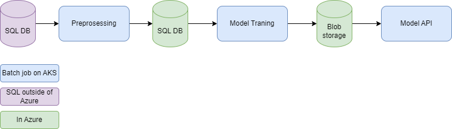
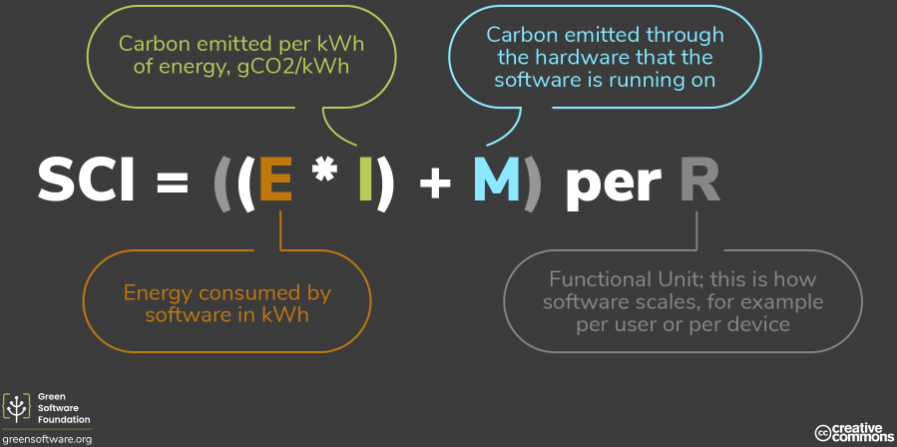

# cs-e4660 Course repo

## Dir Structure

Most of the project and course tasks are contained in folders, which contain their own documentation:

- `./data` The dataset used in the project
- `./data-fetch` Project mock data fetcher
- `./database` Config for database used in project
- `./model-api` Project model api serving predictions
- `./model-training` Project model training
- `./preprocessing` Project mock preprocessing
- `./project-plan` The initial project plan 
- `./study-logs` Study logs written during the course

## Project: Green e2e ML
Seen initial project plan in [project-plan](./project-plan/) folder

### Background

- At work we have an ML pipeline, which currently has no proper orchestration & no workflow engine used
- The pipeline is quite simple, however, there are more similar simple pipelines coming in the future
- Engineering challenge: how to support and maintain ML pipelines on existing (shared) infra with quite small DevOps team

#### Existing pipeline

- Financial management SaaS product
- Invoice field predictions (VAT %, amount, receiver, etc...) using Randomforest classifier
- Similar pipelines expected in the future to help predict financial management & accounting related
- ML pipelines run on a (shared) Kubernetes cluster (AKS)

### Challenges to be solved

This project attempts to solve two main challenges:

1. Best solution for DevOps engineers to create and maintain ML pipelines on a shared (Azure) Kubernetes cluster
2. How to make the pipelines green (and by proxy cheap and efficient)

### Emulating the real environment (story)

The real environment runs on an AKS cluster in the west europe datacenter. The aks cluster has an autoscaling nodepool. This means that the cluster is able to scale based on resources usage. 

The testbed is a local aks cluster on my machine. Still, we pretend it's a scalable custer running in west europe (Germany). These factors are relevant when thinking about scheduling and scaling of the solution, as well determining the carbon intensity of the electric grid.

### Solution 1: Proper orchestration and e2e workflow using workflow engine

#### Pipeline Orchestration tools Comparison

Here is a comparisons table based on the different requirements of the system described above.

|                                                | Argo Workflows | Kubeflow | Apache airflow |
|------------------------------------------------|----------------|----------|----------------|
| Kubernetes support                             |       yes      |     yes  | technically yes, could not get working |
| CasC                                           |       yaml (kubernetes)         |    pipeline sdk (python)/proprietary dsl      |      python sdk (not tested)          |
| Learning curve for DevOps   (personal estimate) |    medium(*)   |    high(**)      |       n/a     |
| Scheduling                                      |        yes     |          |                |
| Event triggering                               |        yes     |          |                |
| Logging                                        |      Kubernetes logs (native kubernetes jobs)       |          |                |
| Alerting                                       |      integrations to slack and Opsgenie          |          |                |
| Good UI (usable by ML engineers)               |                |          |                |

(*) kubernetes like yaml syntax to configure workflows 

(**) Uses argo workflow under the hood, but configured in python. This might be the best solution for ML engineers, but since in this case the pipeline needs to be maintained by DevOps engineers it's not ideal,

#### Mock pipeline parts

Based on the comparison Argo Workflows as chosen as the pipeline orchestration tool / workflow engine. This means the different pipeline steps are containerized, more info on these in their own folders (in order):

- `./data-fetch` Project mock data fetcher
- `./preprocessing` Project mock preprocessing
- `./model-training` Project model training
- `./model-api` Project model api serving predictions

The initial pipeline solution was to use kubernetes (batch) Jobs. These configurations can still be seen in the folders above, but aren't utilized in the final solution.

#### Argo workflows and the pipeline

The Argo workflow configuration and pipeline configurations are in the `./pipeline` folder.

#### Discussion on the pipeline solution

The functionality of the pipeline is documented in `./pipeline/argo.md`

#TODO:
- See how the pipeline solution supports and enables R3E + Monitoring, Observability & Experimenting
  - what restrictions come from existing ML pipeline, what restrictions (potentially) come from workflow pipeline solution being implemented
  - what areas of R3E + Monitoring, Observability & Experimenting can't be solved by orchestration & workflow engine (just figure out, supporting these out of scope)

### Solution 2: Making the pipeline green

#### Pipeline scheduling

Scheduling can help make the pipeline green in two ways:
- scheduling frequency
  - the real pipeline is currently run nightly, but by assessing model performance on incoming training data (or potentially by getting feedback on predictions) we can make determinations on when to re-train the model(s)
- scheduling timing
  - the *carbon intensity* of the electric grid changes based on certain factors (see [Planning document](./project-plan/plan.md) for more details)
  - the mock pipeline is run in a local kubernetes cluster, but we pretend it's running in a specific Azure datacenter (west europe) and use APIs to see when the datacenter has low carbon intensity

This table shows the plan to combine both scheduling factors into one solution:

| Accuracy of model on new training data | Action  |
|----------------------------------------|---------|
| Small decrease compared to initial training accuracy (to be quantified) | Retrain model once carbon intensity drops below set threshold |
| Big decrease ...                                                       | Retrain model immediately |

#### Metrics collection

#Fixme placehoder just copied from planning doc:

*Green software foundation*

- See which parts of the pipeline contribute most to co2 emissions
- See trends over time, sudden increases etc.
- SCI: https://learn.greensoftware.foundation/measurement/#the-sci-equation

## (sort out)

- scaling
- what can be scaled
- customers vs 
